# 📊 Echoes Backend Architecture Diagrams

This document contains comprehensive Mermaid diagrams visualizing the Echoes backend architecture, data structures, relationships, and function flows.

## 🏗️ System Architecture Overview

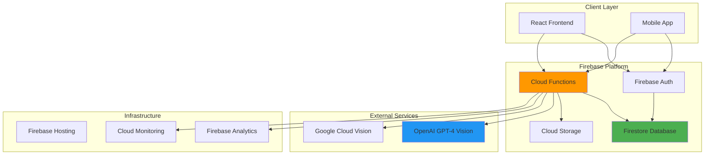
```mermaid
graph TB
    subgraph "Client Layer"
        A[React Frontend]
        B[Mobile App]
    end
    
    subgraph "Firebase Platform"
        C[Firebase Auth]
        D[Cloud Functions]
        E[Firestore Database]
        F[Cloud Storage]
    end
    
    subgraph "External Services"
        G[OpenAI GPT-4 Vision]
        H[Google Cloud Vision]
    end
    
    subgraph "Infrastructure"
        I[Firebase Hosting]
        J[Firebase Analytics]
        K[Cloud Monitoring]
    end
    
    A --> C
    B --> C
    A --> D
    B --> D
    
    D --> E
    D --> F
    D --> G
    D --> H
    
    C --> E
    
    D --> J
    D --> K
    
    style D fill:#ff9800
    style E fill:#4caf50
    style G fill:#2196f3
```

## 🗄️ Database Schema & Relationships

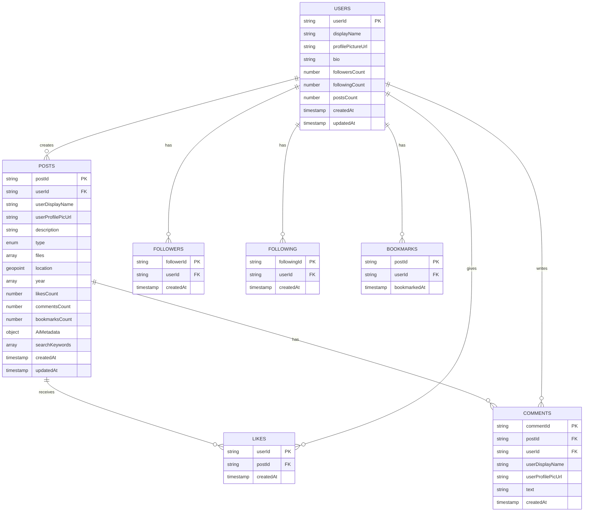
```mermaid
erDiagram
    USERS {
        string userId PK
        string displayName
        string profilePictureUrl
        string bio
        number followersCount
        number followingCount
        number postsCount
        timestamp createdAt
        timestamp updatedAt
    }
    
    POSTS {
        string postId PK
        string userId FK
        string userDisplayName
        string userProfilePicUrl
        string description
        enum type
        array files
        geopoint location
        array year
        number likesCount
        number commentsCount
        number bookmarksCount
        object AiMetadata
        array searchKeywords
        timestamp createdAt
        timestamp updatedAt
    }
    
    FOLLOWERS {
        string followerId PK
        string userId FK
        timestamp createdAt
    }
    
    FOLLOWING {
        string followingId PK
        string userId FK
        timestamp createdAt
    }
    
    BOOKMARKS {
        string postId PK
        string userId FK
        timestamp bookmarkedAt
    }
    
    LIKES {
        string userId PK
        string postId FK
        timestamp createdAt
    }
    
    COMMENTS {
        string commentId PK
        string postId FK
        string userId FK
        string userDisplayName
        string userProfilePicUrl
        string text
        timestamp createdAt
    }
    
    USERS ||--o{ POSTS : "creates"
    USERS ||--o{ FOLLOWERS : "has"
    USERS ||--o{ FOLLOWING : "has"
    USERS ||--o{ BOOKMARKS : "has"
    POSTS ||--o{ LIKES : "receives"
    POSTS ||--o{ COMMENTS : "has"
    USERS ||--o{ LIKES : "gives"
    USERS ||--o{ COMMENTS : "writes"
```

## 🔄 API Gateway Function Flow

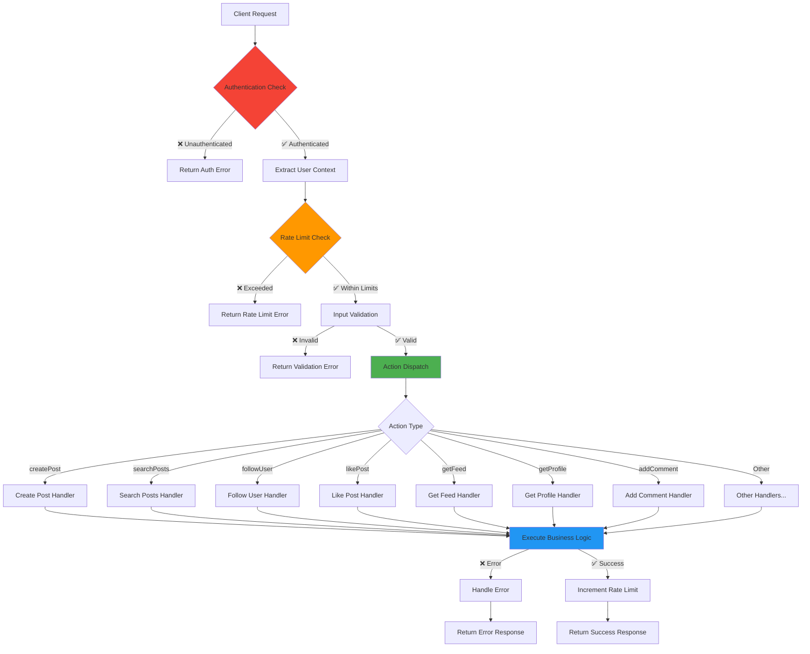
```mermaid
flowchart TD
    A[Client Request] --> B{Authentication Check}
    B -->|❌ Unauthenticated| C[Return Auth Error]
    B -->|✅ Authenticated| D[Extract User Context]
    
    D --> E{Rate Limit Check}
    E -->|❌ Exceeded| F[Return Rate Limit Error]
    E -->|✅ Within Limits| G[Input Validation]
    
    G -->|❌ Invalid| H[Return Validation Error]
    G -->|✅ Valid| I[Action Dispatch]
    
    I --> J{Action Type}
    
    J -->|createPost| K[Create Post Handler]
    J -->|searchPosts| L[Search Posts Handler]
    J -->|followUser| M[Follow User Handler]
    J -->|likePost| N[Like Post Handler]
    J -->|getFeed| O[Get Feed Handler]
    J -->|getProfile| P[Get Profile Handler]
    J -->|addComment| Q[Add Comment Handler]
    J -->|Other| R[Other Handlers...]
    
    K --> S[Execute Business Logic]
    L --> S
    M --> S
    N --> S
    O --> S
    P --> S
    Q --> S
    R --> S
    
    S -->|❌ Error| T[Handle Error]
    S -->|✅ Success| U[Increment Rate Limit]
    
    U --> V[Return Success Response]
    T --> W[Return Error Response]
    
    style B fill:#f44336
    style E fill:#ff9800
    style I fill:#4caf50
    style S fill:#2196f3
```

## 🤖 AI Analysis Pipeline

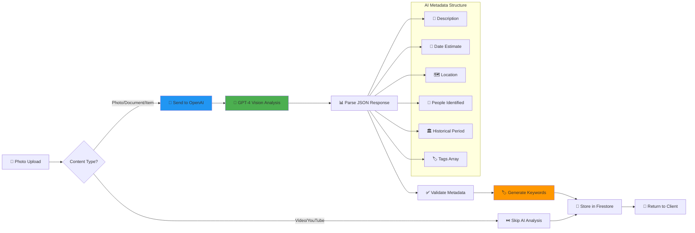
```mermaid
flowchart LR
    A[📸 Photo Upload] --> B{Content Type?}
    
    B -->|Photo/Document/Item| C[🤖 Send to OpenAI]
    B -->|Video/YouTube| D[⏭️ Skip AI Analysis]
    
    C --> E[🧠 GPT-4 Vision Analysis]
    E --> F[📊 Parse JSON Response]
    F --> G[✅ Validate Metadata]
    G --> H[🏷️ Generate Keywords]
    
    H --> I[💾 Store in Firestore]
    D --> I
    
    I --> J[📱 Return to Client]
    
    subgraph "AI Metadata Structure"
        K[📝 Description]
        L[📅 Date Estimate]
        M[🗺️ Location]
        N[👥 People Identified]
        O[🏛️ Historical Period]
        P[🏷️ Tags Array]
    end
    
    F --> K
    F --> L
    F --> M
    F --> N
    F --> O
    F --> P
    
    style C fill:#2196f3
    style E fill:#4caf50
    style H fill:#ff9800
```

## 🔍 Search System Architecture

```mermaid
graph TD
    A[User Query: "vintage cars 1950s"] --> B[Query Processing]
    
    B --> C[Lowercase & Clean]
    C --> D[Split into Terms]
    D --> E[Filter Valid Terms]
    
    E --> F[Firestore Query]
    F --> G[array-contains-any searchKeywords]
    
    G --> H[Get Results x3 Limit]
    H --> I[Client-Side Filtering]
    
    I --> J{All Terms Present?}
    J -->|❌ No| K[Filter Out]
    J -->|✅ Yes| L[Calculate Relevance]
    
    L --> M[Relevance Scoring]
    
    subgraph "Scoring Factors"
        N[Description Match: +10]
        O[Tag Match: +8]
        P[AI Tag Match: +7]
        Q[Subject Term: +6]
        R[Geographic: +5]
        S[Keyword: +1]
        T[Engagement Boost]
    end
    
    M --> N
    M --> O
    M --> P
    M --> Q
    M --> R
    M --> S
    M --> T
    
    T --> U[Sort by Relevance]
    U --> V[Add User Interactions]
    V --> W[Return Paginated Results]
    
    style F fill:#4caf50
    style M fill:#ff9800
    style U fill:#2196f3
```

## 👥 Social Features Flow

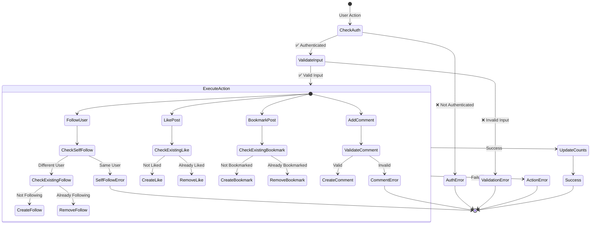
```mermaid
stateDiagram-v2
    [*] --> CheckAuth : User Action
    
    CheckAuth --> AuthError : ❌ Not Authenticated
    CheckAuth --> ValidateInput : ✅ Authenticated
    
    ValidateInput --> ValidationError : ❌ Invalid Input
    ValidateInput --> ExecuteAction : ✅ Valid Input
    
    state ExecuteAction {
        [*] --> FollowUser
        [*] --> LikePost
        [*] --> BookmarkPost
        [*] --> AddComment
        
        FollowUser --> CheckSelfFollow
        CheckSelfFollow --> SelfFollowError : Same User
        CheckSelfFollow --> CheckExistingFollow : Different User
        CheckExistingFollow --> CreateFollow : Not Following
        CheckExistingFollow --> RemoveFollow : Already Following
        
        LikePost --> CheckExistingLike
        CheckExistingLike --> CreateLike : Not Liked
        CheckExistingLike --> RemoveLike : Already Liked
        
        BookmarkPost --> CheckExistingBookmark
        CheckExistingBookmark --> CreateBookmark : Not Bookmarked
        CheckExistingBookmark --> RemoveBookmark : Already Bookmarked
        
        AddComment --> ValidateComment
        ValidateComment --> CreateComment : Valid
        ValidateComment --> CommentError : Invalid
    }
    
    ExecuteAction --> UpdateCounts : Success
    ExecuteAction --> ActionError : Failure
    
    UpdateCounts --> Success
    
    AuthError --> [*]
    ValidationError --> [*]
    SelfFollowError --> [*]
    ActionError --> [*]
    CommentError --> [*]
    Success --> [*]
```

## ⚡ Rate Limiting System

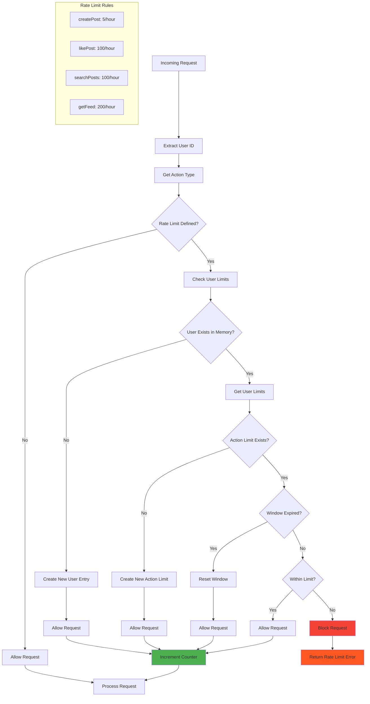
```mermaid
graph TB
    A[Incoming Request] --> B[Extract User ID]
    B --> C[Get Action Type]
    C --> D{Rate Limit Defined?}
    
    D -->|No| E[Allow Request]
    D -->|Yes| F[Check User Limits]
    
    F --> G{User Exists in Memory?}
    G -->|No| H[Create New User Entry]
    G -->|Yes| I[Get User Limits]
    
    H --> J[Allow Request]
    I --> K{Action Limit Exists?}
    
    K -->|No| L[Create New Action Limit]
    K -->|Yes| M{Window Expired?}
    
    L --> N[Allow Request]
    M -->|Yes| O[Reset Window]
    M -->|No| P{Within Limit?}
    
    O --> Q[Allow Request]
    P -->|Yes| R[Allow Request]
    P -->|No| S[Block Request]
    
    R --> T[Increment Counter]
    Q --> T
    N --> T
    J --> T
    E --> U[Process Request]
    
    T --> U
    S --> V[Return Rate Limit Error]
    
    subgraph "Rate Limit Rules"
        W[createPost: 5/hour]
        X[likePost: 100/hour]
        Y[searchPosts: 100/hour]
        Z[getFeed: 200/hour]
    end
    
    style S fill:#f44336
    style T fill:#4caf50
    style V fill:#ff5722
```

## 🔐 Security & Validation Flow

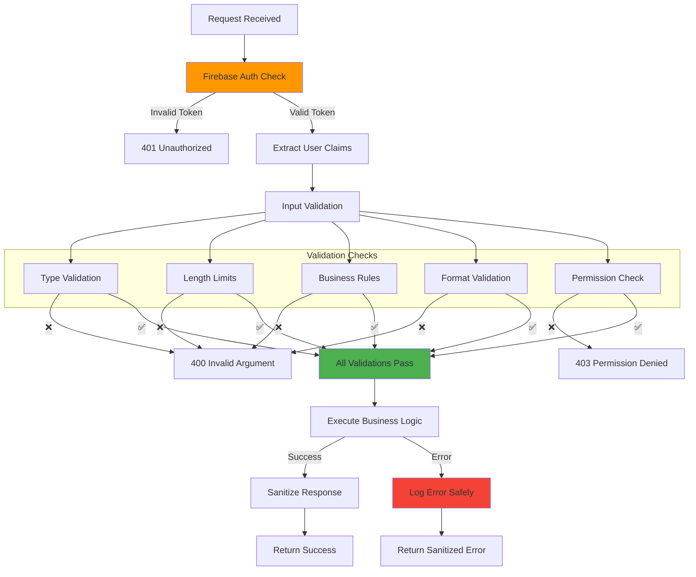
```mermaid
flowchart TD
    A[Request Received] --> B[Firebase Auth Check]
    
    B -->|Invalid Token| C[401 Unauthorized]
    B -->|Valid Token| D[Extract User Claims]
    
    D --> E[Input Validation]
    
    subgraph "Validation Checks"
        F[Type Validation]
        G[Length Limits]
        H[Business Rules]
        I[Format Validation]
        J[Permission Check]
    end
    
    E --> F
    E --> G
    E --> H
    E --> I
    E --> J
    
    F -->|❌| K[400 Invalid Argument]
    G -->|❌| K
    H -->|❌| K
    I -->|❌| K
    J -->|❌| L[403 Permission Denied]
    
    F -->|✅| M[All Validations Pass]
    G -->|✅| M
    H -->|✅| M
    I -->|✅| M
    J -->|✅| M
    
    M --> N[Execute Business Logic]
    
    N -->|Success| O[Sanitize Response]
    N -->|Error| P[Log Error Safely]
    
    O --> Q[Return Success]
    P --> R[Return Sanitized Error]
    
    style B fill:#ff9800
    style M fill:#4caf50
    style P fill:#f44336
```

## 📊 Performance Monitoring

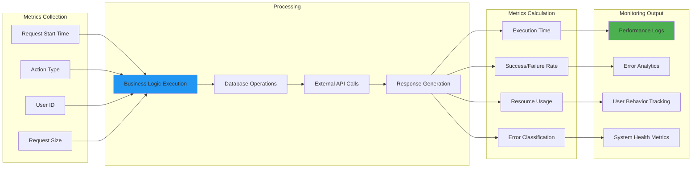
```mermaid
graph LR
    subgraph "Metrics Collection"
        A[Request Start Time]
        B[Action Type]
        C[User ID]
        D[Request Size]
    end
    
    subgraph "Processing"
        E[Business Logic Execution]
        F[Database Operations]
        G[External API Calls]
        H[Response Generation]
    end
    
    subgraph "Metrics Calculation"
        I[Execution Time]
        J[Success/Failure Rate]
        K[Resource Usage]
        L[Error Classification]
    end
    
    subgraph "Monitoring Output"
        M[Performance Logs]
        N[Error Analytics]
        O[User Behavior Tracking]
        P[System Health Metrics]
    end
    
    A --> E
    B --> E
    C --> E
    D --> E
    
    E --> F
    F --> G
    G --> H
    
    H --> I
    H --> J
    H --> K
    H --> L
    
    I --> M
    J --> N
    K --> O
    L --> P
    
    style E fill:#2196f3
    style M fill:#4caf50
```

## 🔄 Transaction Safety Pattern

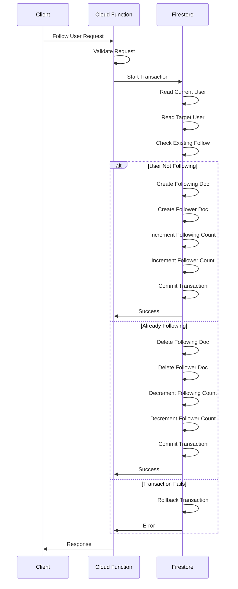
```mermaid
sequenceDiagram
    participant C as Client
    participant F as Cloud Function
    participant DB as Firestore
    
    C->>F: Follow User Request
    F->>F: Validate Request
    F->>DB: Start Transaction
    
    DB->>DB: Read Current User
    DB->>DB: Read Target User
    DB->>DB: Check Existing Follow
    
    alt User Not Following
        DB->>DB: Create Following Doc
        DB->>DB: Create Follower Doc
        DB->>DB: Increment Following Count
        DB->>DB: Increment Follower Count
        DB->>DB: Commit Transaction
        DB->>F: Success
    else Already Following
        DB->>DB: Delete Following Doc
        DB->>DB: Delete Follower Doc
        DB->>DB: Decrement Following Count
        DB->>DB: Decrement Follower Count
        DB->>DB: Commit Transaction
        DB->>F: Success
    else Transaction Fails
        DB->>DB: Rollback Transaction
        DB->>F: Error
    end
    
    F->>C: Response
```

## 🌍 Geographic Query System

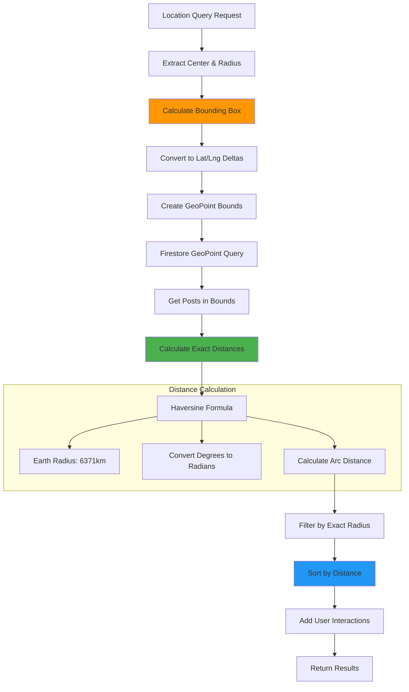
```mermaid
graph TD
    A[Location Query Request] --> B[Extract Center & Radius]
    B --> C[Calculate Bounding Box]
    
    C --> D[Convert to Lat/Lng Deltas]
    D --> E[Create GeoPoint Bounds]
    
    E --> F[Firestore GeoPoint Query]
    F --> G[Get Posts in Bounds]
    
    G --> H[Calculate Exact Distances]
    
    subgraph "Distance Calculation"
        I[Haversine Formula]
        J[Earth Radius: 6371km]
        K[Convert Degrees to Radians]
        L[Calculate Arc Distance]
    end
    
    H --> I
    I --> J
    I --> K
    I --> L
    
    L --> M[Filter by Exact Radius]
    M --> N[Sort by Distance]
    N --> O[Add User Interactions]
    O --> P[Return Results]
    
    style C fill:#ff9800
    style H fill:#4caf50
    style N fill:#2196f3
```

## 📱 Client-Server Data Flow

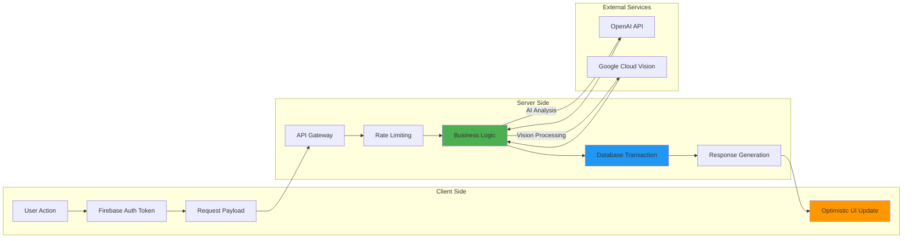
```mermaid
flowchart LR
    subgraph "Client Side"
        A[User Action]
        B[Firebase Auth Token]
        C[Request Payload]
        D[Optimistic UI Update]
    end
    
    subgraph "Server Side"
        E[API Gateway]
        F[Rate Limiting]
        G[Business Logic]
        H[Database Transaction]
        I[Response Generation]
    end
    
    subgraph "External Services"
        J[OpenAI API]
        K[Google Cloud Vision]
    end
    
    A --> B
    B --> C
    C --> E
    
    E --> F
    F --> G
    G --> H
    
    G -->|AI Analysis| J
    G -->|Vision Processing| K
    
    J --> G
    K --> G
    
    H --> I
    I --> D
    
    style D fill:#ff9800
    style G fill:#4caf50
    style H fill:#2196f3
```

## 🔄 State Management Flow

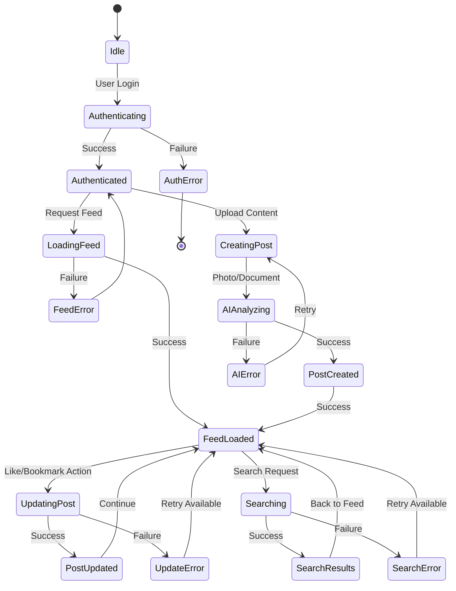
```mermaid
stateDiagram-v2
    [*] --> Idle
    
    Idle --> Authenticating : User Login
    Authenticating --> Authenticated : Success
    Authenticating --> AuthError : Failure
    
    Authenticated --> LoadingFeed : Request Feed
    LoadingFeed --> FeedLoaded : Success
    LoadingFeed --> FeedError : Failure
    
    FeedLoaded --> UpdatingPost : Like/Bookmark Action
    UpdatingPost --> PostUpdated : Success
    UpdatingPost --> UpdateError : Failure
    
    PostUpdated --> FeedLoaded : Continue
    UpdateError --> FeedLoaded : Retry Available
    
    FeedLoaded --> Searching : Search Request
    Searching --> SearchResults : Success
    Searching --> SearchError : Failure
    
    SearchResults --> FeedLoaded : Back to Feed
    SearchError --> FeedLoaded : Retry Available
    
    Authenticated --> CreatingPost : Upload Content
    CreatingPost --> AIAnalyzing : Photo/Document
    AIAnalyzing --> PostCreated : Success
    AIAnalyzing --> AIError : Failure
    
    PostCreated --> FeedLoaded : Success
    AIError --> CreatingPost : Retry
    
    AuthError --> [*]
    FeedError --> Authenticated
```

## 🎯 Detailed User Action Flows

### Like Post Flow

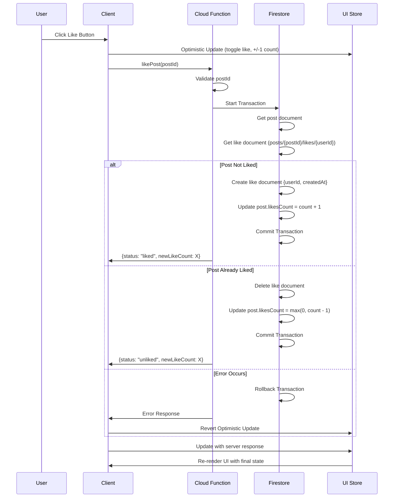
```mermaid
sequenceDiagram
    participant U as User
    participant C as Client
    participant F as Cloud Function
    participant DB as Firestore
    participant UI as UI Store
    
    U->>C: Click Like Button
    C->>UI: Optimistic Update (toggle like, +/-1 count)
    C->>F: likePost(postId)
    
    F->>F: Validate postId
    F->>DB: Start Transaction
    
    DB->>DB: Get post document
    DB->>DB: Get like document (posts/{postId}/likes/{userId})
    
    alt Post Not Liked
        DB->>DB: Create like document {userId, createdAt}
        DB->>DB: Update post.likesCount = count + 1
        DB->>DB: Commit Transaction
        F->>C: {status: "liked", newLikeCount: X}
    else Post Already Liked
        DB->>DB: Delete like document
        DB->>DB: Update post.likesCount = max(0, count - 1)
        DB->>DB: Commit Transaction
        F->>C: {status: "unliked", newLikeCount: X}
    else Error Occurs
        DB->>DB: Rollback Transaction
        F->>C: Error Response
        C->>UI: Revert Optimistic Update
    end
    
    C->>UI: Update with server response
    UI->>C: Re-render UI with final state
```

### Create Post Flow

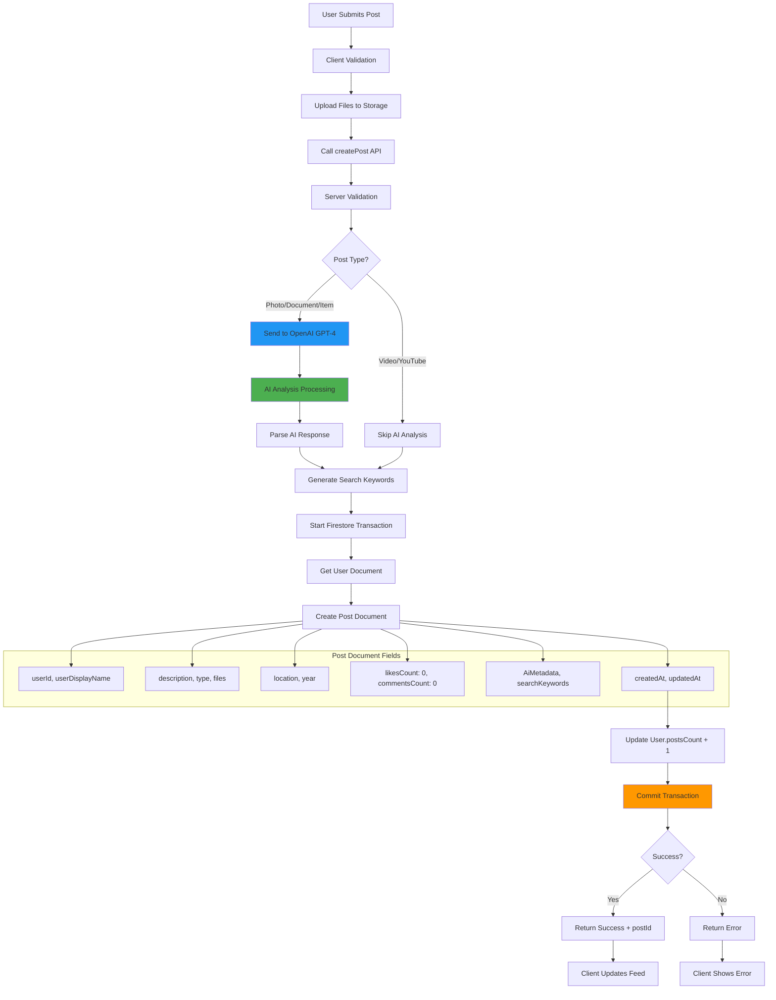
```mermaid
flowchart TD
    A[User Submits Post] --> B[Client Validation]
    B --> C[Upload Files to Storage]
    C --> D[Call createPost API]
    
    D --> E[Server Validation]
    E --> F{Post Type?}
    
    F -->|Photo/Document/Item| G[Send to OpenAI GPT-4]
    F -->|Video/YouTube| H[Skip AI Analysis]
    
    G --> I[AI Analysis Processing]
    I --> J[Parse AI Response]
    J --> K[Generate Search Keywords]
    
    H --> K
    K --> L[Start Firestore Transaction]
    
    L --> M[Get User Document]
    M --> N[Create Post Document]
    
    subgraph "Post Document Fields"
        O[userId, userDisplayName]
        P[description, type, files]
        Q[location, year]
        R[likesCount: 0, commentsCount: 0]
        S[AiMetadata, searchKeywords]
        T[createdAt, updatedAt]
    end
    
    N --> O
    N --> P
    N --> Q
    N --> R
    N --> S
    N --> T
    
    T --> U[Update User.postsCount + 1]
    U --> V[Commit Transaction]
    
    V --> W{Success?}
    W -->|Yes| X[Return Success + postId]
    W -->|No| Y[Return Error]
    
    X --> Z[Client Updates Feed]
    Y --> AA[Client Shows Error]
    
    style G fill:#2196f3
    style I fill:#4caf50
    style V fill:#ff9800
```

### Follow User Flow

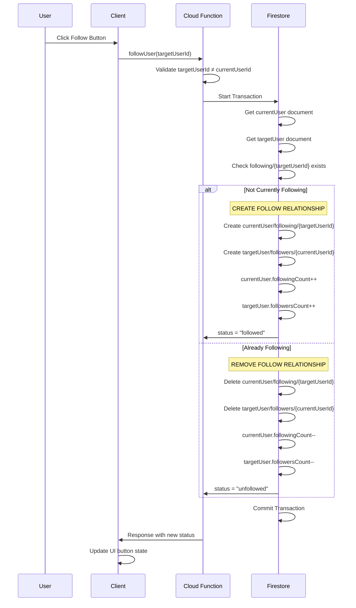
```mermaid
sequenceDiagram
    participant U as User
    participant C as Client
    participant F as Cloud Function
    participant DB as Firestore
    
    U->>C: Click Follow Button
    C->>F: followUser(targetUserId)
    
    F->>F: Validate targetUserId ≠ currentUserId
    F->>DB: Start Transaction
    
    DB->>DB: Get currentUser document
    DB->>DB: Get targetUser document
    DB->>DB: Check following/{targetUserId} exists
    
    alt Not Currently Following
        Note over DB: CREATE FOLLOW RELATIONSHIP
        DB->>DB: Create currentUser/following/{targetUserId}
        DB->>DB: Create targetUser/followers/{currentUserId}
        DB->>DB: currentUser.followingCount++
        DB->>DB: targetUser.followersCount++
        DB->>F: status = "followed"
    else Already Following
        Note over DB: REMOVE FOLLOW RELATIONSHIP
        DB->>DB: Delete currentUser/following/{targetUserId}
        DB->>DB: Delete targetUser/followers/{currentUserId}
        DB->>DB: currentUser.followingCount--
        DB->>DB: targetUser.followersCount--
        DB->>F: status = "unfollowed"
    end
    
    DB->>DB: Commit Transaction
    F->>C: Response with new status
    C->>C: Update UI button state
```

### Search Posts Flow

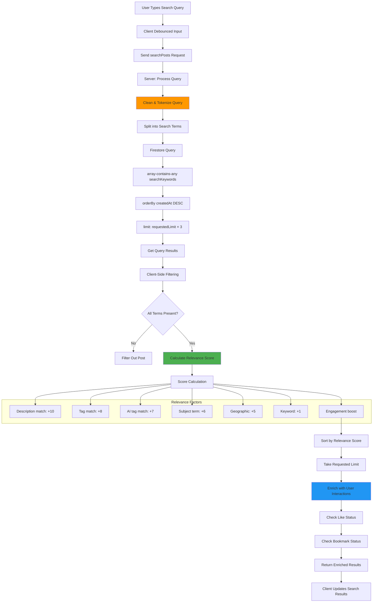
```mermaid
flowchart TD
    A[User Types Search Query] --> B[Client Debounced Input]
    B --> C[Send searchPosts Request]
    
    C --> D[Server: Process Query]
    D --> E[Clean & Tokenize Query]
    E --> F[Split into Search Terms]
    
    F --> G[Firestore Query]
    G --> H[array-contains-any searchKeywords]
    H --> I[orderBy createdAt DESC]
    I --> J[limit: requestedLimit × 3]
    
    J --> K[Get Query Results]
    K --> L[Client-Side Filtering]
    
    L --> M{All Terms Present?}
    M -->|No| N[Filter Out Post]
    M -->|Yes| O[Calculate Relevance Score]
    
    O --> P[Score Calculation]
    
    subgraph "Relevance Factors"
        Q[Description match: +10]
        R[Tag match: +8]
        S[AI tag match: +7]
        T[Subject term: +6]
        U[Geographic: +5]
        V[Keyword: +1]
        W[Engagement boost]
    end
    
    P --> Q
    P --> R
    P --> S
    P --> T
    P --> U
    P --> V
    P --> W
    
    W --> X[Sort by Relevance Score]
    X --> Y[Take Requested Limit]
    Y --> Z[Enrich with User Interactions]
    
    Z --> AA[Check Like Status]
    AA --> BB[Check Bookmark Status]
    BB --> CC[Return Enriched Results]
    
    CC --> DD[Client Updates Search Results]
    
    style E fill:#ff9800
    style O fill:#4caf50
    style Z fill:#2196f3
```

### Add Comment Flow

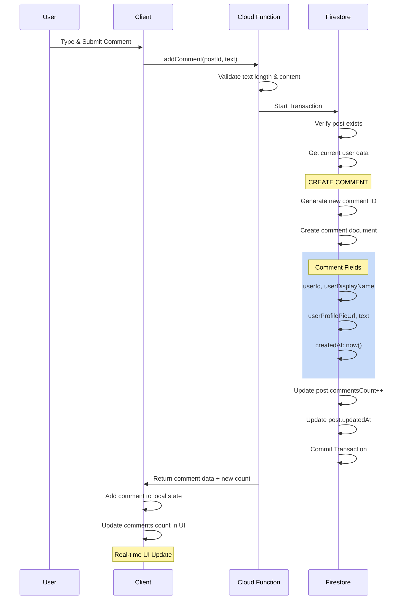
```mermaid
sequenceDiagram
    participant U as User
    participant C as Client
    participant F as Cloud Function
    participant DB as Firestore
    
    U->>C: Type & Submit Comment
    C->>F: addComment(postId, text)
    
    F->>F: Validate text length & content
    F->>DB: Start Transaction
    
    DB->>DB: Verify post exists
    DB->>DB: Get current user data
    
    Note over DB: CREATE COMMENT
    DB->>DB: Generate new comment ID
    DB->>DB: Create comment document
    
    rect rgb(200, 220, 250)
        Note over DB: Comment Fields
        DB->>DB: userId, userDisplayName
        DB->>DB: userProfilePicUrl, text
        DB->>DB: createdAt: now()
    end
    
    DB->>DB: Update post.commentsCount++
    DB->>DB: Update post.updatedAt
    DB->>DB: Commit Transaction
    
    F->>C: Return comment data + new count
    C->>C: Add comment to local state
    C->>C: Update comments count in UI
    
    Note over C: Real-time UI Update
```

### Get Feed Flow

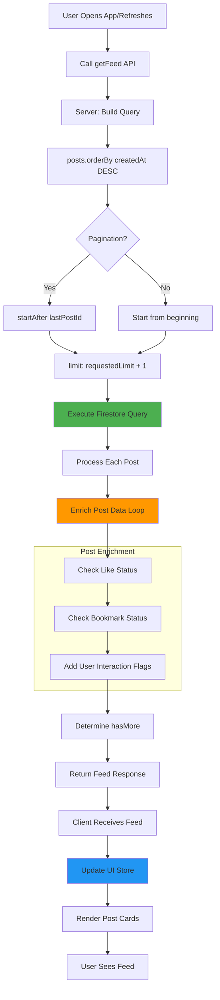
```mermaid
flowchart TD
    A[User Opens App/Refreshes] --> B[Call getFeed API]
    B --> C[Server: Build Query]
    
    C --> D[posts.orderBy createdAt DESC]
    D --> E{Pagination?}
    E -->|Yes| F[startAfter lastPostId]
    E -->|No| G[Start from beginning]
    
    F --> H[limit: requestedLimit + 1]
    G --> H
    
    H --> I[Execute Firestore Query]
    I --> J[Process Each Post]
    
    J --> K[Enrich Post Data Loop]
    
    subgraph "Post Enrichment"
        L[Check Like Status]
        M[Check Bookmark Status]
        N[Add User Interaction Flags]
    end
    
    K --> L
    L --> M
    M --> N
    
    N --> O[Determine hasMore]
    O --> P[Return Feed Response]
    
    P --> Q[Client Receives Feed]
    Q --> R[Update UI Store]
    R --> S[Render Post Cards]
    
    S --> T[User Sees Feed]
    
    style I fill:#4caf50
    style K fill:#ff9800
    style R fill:#2196f3
```

### Bookmark Post Flow

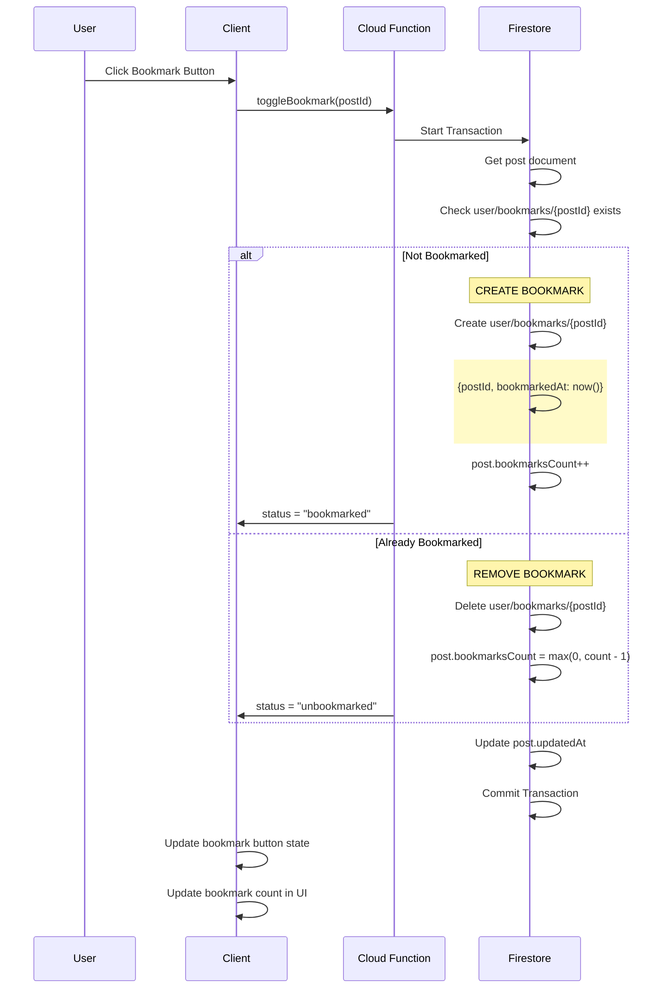
```mermaid
sequenceDiagram
    participant U as User
    participant C as Client
    participant F as Cloud Function
    participant DB as Firestore
    
    U->>C: Click Bookmark Button
    C->>F: toggleBookmark(postId)
    
    F->>DB: Start Transaction
    DB->>DB: Get post document
    DB->>DB: Check user/bookmarks/{postId} exists
    
    alt Not Bookmarked
        Note over DB: CREATE BOOKMARK
        DB->>DB: Create user/bookmarks/{postId}
        rect rgb(255, 250, 200)
            DB->>DB: {postId, bookmarkedAt: now()}
        end
        DB->>DB: post.bookmarksCount++
        F->>C: status = "bookmarked"
    else Already Bookmarked
        Note over DB: REMOVE BOOKMARK
        DB->>DB: Delete user/bookmarks/{postId}
        DB->>DB: post.bookmarksCount = max(0, count - 1)
        F->>C: status = "unbookmarked"
    end
    
    DB->>DB: Update post.updatedAt
    DB->>DB: Commit Transaction
    
    C->>C: Update bookmark button state
    C->>C: Update bookmark count in UI
```

### Delete Post Flow

```mermaid
flowchart TD
    A[User Clicks Delete] --> B[Confirm Dialog]
    B --> C[Call deletePost API]
    
    C --> D[Verify Post Ownership]
    D --> E{Owner Check}
    E -->|Not Owner| F[Return Permission Error]
    E -->|Is Owner| G[Start Transaction]
    
    G --> H[Get Post Document]
    H --> I[Get All Subcollections]
    
    I --> J[Delete All Likes]
    J --> K[Delete All Comments]
    K --> L[Delete Post Document]
    
    L --> M[Update User Stats]
    M --> N[user.postsCount = max(0, count - 1)]
    N --> O[Commit Transaction]
    
    O --> P{Success?}
    P -->|Yes| Q[Return Success]
    P -->|No| R[Return Error]
    
    Q --> S[Client Removes from Feed]
    S --> T[Update UI Store]
    T --> U[Re-render Feed]
    
    R --> V[Show Error Message]
    
    style D fill:#ff9800
    style I fill:#f44336
    style O fill:#4caf50
```

### User Profile Creation Flow

```mermaid
sequenceDiagram
    participant U as User
    participant A as Firebase Auth
    participant F as Cloud Function
    participant DB as Firestore
    
    U->>A: Sign Up/Sign In
    A->>U: Returns Auth Token
    U->>F: createUserProfile(displayName, photoURL)
    
    F->>DB: Check if profile exists
    
    alt Profile Exists
        DB->>F: Return existing profile
        F->>U: Profile already exists
    else Profile Doesn't Exist
        Note over DB: CREATE NEW PROFILE
        DB->>DB: Create user document
        
        rect rgb(200, 255, 200)
            Note over DB: Default Profile Fields
            DB->>DB: displayName or auto-generated
            DB->>DB: profilePictureUrl or null
            DB->>DB: followersCount: 0
            DB->>DB: followingCount: 0
            DB->>DB: postsCount: 0
            DB->>DB: bio: empty
            DB->>DB: createdAt: now()
        end
        
        DB->>F: Profile created successfully
        F->>U: Return new profile data
    end
    
    U->>U: Navigate to main app
```

### Geographic Search Flow

```mermaid
flowchart TD
    A[User Searches by Location] --> B[Get Current Location or Input]
    B --> C[Set Search Radius]
    C --> D[Calculate Bounding Box]
    
    D --> E[Convert to Lat/Lng Deltas]
    E --> F[Create GeoPoint Bounds]
    F --> G[Firestore GeoPoint Query]
    
    G --> H[Get Posts in Bounds]
    H --> I[Calculate Exact Distances]
    
    subgraph "Distance Calculation"
        J[For Each Post]
        K[Extract lat/lng from GeoPoint]
        L[Apply Haversine Formula]
        M[Calculate Distance in KM]
    end
    
    I --> J
    J --> K
    K --> L
    L --> M
    
    M --> N{Within Radius?}
    N -->|Yes| O[Add to Results]
    N -->|No| P[Filter Out]
    
    O --> Q[Sort by Distance]
    Q --> R[Enrich with Interactions]
    R --> S[Return Location Results]
    
    S --> T[Client Shows Map View]
    T --> U[Display Post Markers]
    
    style D fill:#ff9800
    style I fill:#4caf50
    style Q fill:#2196f3
```

### Rate Limiting Enforcement Flow

```mermaid
flowchart TD
    A[Request Arrives] --> B[Extract User ID & Action]
    B --> C[Get Rate Limit Config]
    
    C --> D{Limit Defined?}
    D -->|No| E[Allow Request]
    D -->|Yes| F[Check Memory Store]
    
    F --> G{User in Memory?}
    G -->|No| H[First Request - Allow]
    G -->|Yes| I[Get User's Action Data]
    
    I --> J{Action Tracked?}
    J -->|No| K[First Action - Allow]
    J -->|Yes| L[Check Time Window]
    
    L --> M{Window Expired?}
    M -->|Yes| N[Reset Counter - Allow]
    M -->|No| O[Check Request Count]
    
    O --> P{Under Limit?}
    P -->|Yes| Q[Increment & Allow]
    P -->|No| R[Block Request]
    
    H --> S[Process Request]
    K --> S
    N --> S
    Q --> S
    E --> S
    
    R --> T[Return 429 Error]
    S --> U[Execute Business Logic]
    U --> V[Increment Success Counter]
    
    subgraph "Memory Cleanup"
        W[Every 15 Minutes]
        X[Remove Expired Entries]
        Y[Free Memory]
    end
    
    V --> W
    W --> X
    X --> Y
    
    style R fill:#f44336
    style V fill:#4caf50
    style O fill:#ff9800
```

---

*These detailed flow diagrams show the exact step-by-step processes that occur when users interact with your Echoes platform, from simple actions like liking posts to complex operations like AI-powered content creation.*
